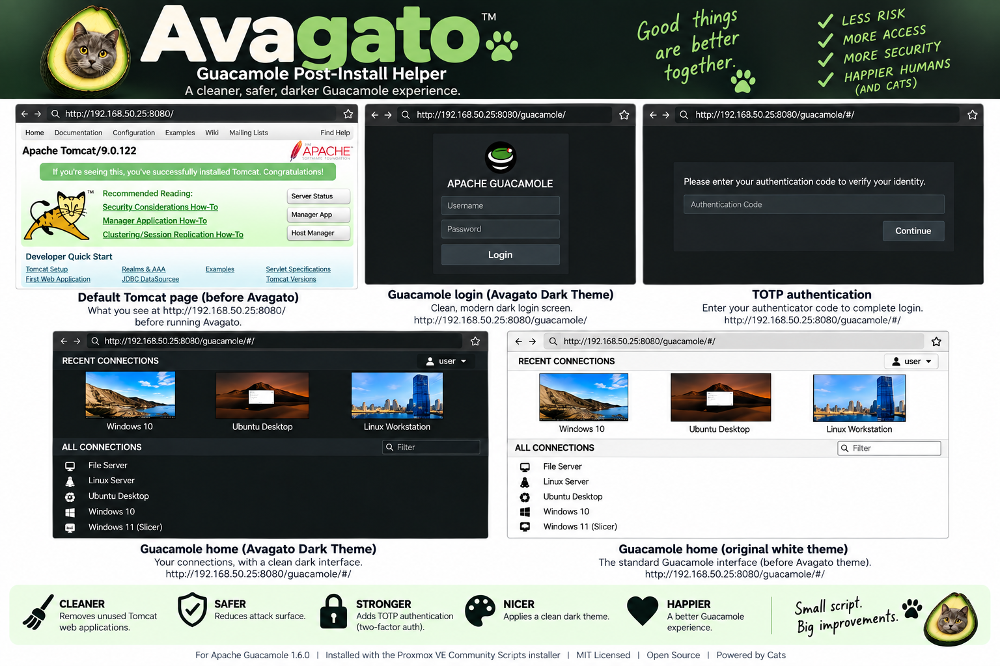
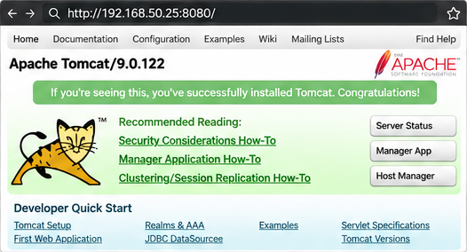
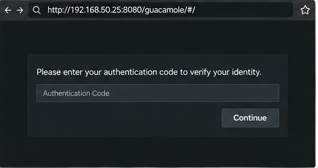
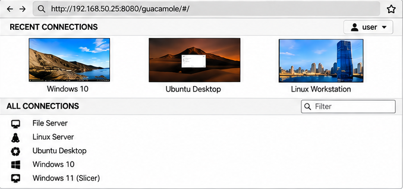
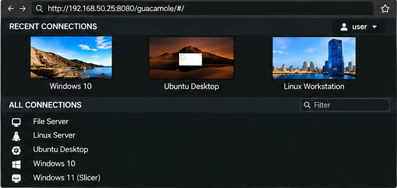
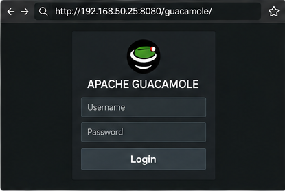

# Avagato



**Avagato** is a tiny post-install helper for Apache Guacamole installations created with the excellent Proxmox VE Community Scripts project.

I'm a big fan of Community Scripts and use it extensively in my homelab. Its Guacamole installer makes getting a working Guacamole server remarkably easy, but there were a few things about the resulting installation that I wanted to change. By default, browsing to the server on port 8080 lands on Tomcat rather than Guacamole, requiring `/guacamole` to be added to the URL — particularly awkward when putting the service behind a reverse proxy. The standard Guacamole interface is also *very* bright, and while Guacamole supports TOTP authentication, the Community Scripts installation does not currently offer it as an installation option.

Avagato packages the small changes I make after installing Guacamole into one simple, optional helper. It can clean up Tomcat and make Guacamole the effective root application, install Guacamole's official TOTP extension, apply a custom dark theme — or do any combination of the three.

Avagato isn't a replacement for the Community Scripts installer. It's a small companion for people who like that installer but prefer their guacamole with a little extra seasoning. And apparently a cat.

> [!IMPORTANT]
> **Take a full Proxmox backup or snapshot before using Avagato.** Avagato preserves the Tomcat files it changes and provides restore options, but those mechanisms are not a substitute for a complete backup.

## Compatibility

**Tested with Apache Guacamole 1.6.0 installed using the Proxmox VE Community Scripts Guacamole installer, as available September 20, 2026.**

Avagato intentionally targets that known installation layout and refuses an unsupported Guacamole version/layout rather than guessing. This statement does **not** mean every past or future Community Scripts Guacamole installer uses Guacamole 1.6.0.

## What Avagato does

### 1. Tomcat cleanup and root redirect

The default Community Scripts installation exposes Tomcat at `http://host:8080/`, while Guacamole itself is at `http://host:8080/guacamole/`. Avagato preserves the original Tomcat ROOT application and replaces it with a tiny redirect so browsing to `/` sends the browser to `/guacamole/`.

It also moves Tomcat's `docs`, `examples`, `manager`, and `host-manager` applications outside `webapps`. They are not required by Guacamole, and disabling unused web applications reduces exposed endpoints. Avagato preserves them for restoration.

This **does not change Guacamole's `/guacamole/` context path**.



### 2. TOTP authentication

Avagato downloads and installs the **official Apache Guacamole TOTP extension** matching Guacamole 1.6.0. Existing Guacamole credentials must already work before enabling TOTP. Users enroll TOTP through Guacamole and then enter an authenticator code during login.



Removing the extension stops Guacamole from requiring TOTP, but it does **not** erase users' TOTP enrollment data from the Guacamole database. Reinstalling the extension can therefore cause previously enrolled users to be asked for their existing authenticator code. Avagato intentionally does not modify or purge TOTP enrollment records.

If a user loses an enrolled authenticator, an administrator can clear that user's TOTP secret using Guacamole's supported reset procedure:

https://guacamole.apache.org/doc/gug/totp-auth.html#resetting-totp-data

Accurate system time is required for TOTP to work correctly.

### 3. Avagato Dark Theme

Avagato builds a small CSS-only Guacamole extension locally and installs it as:

```text
/etc/guacamole/extensions/guacamole-avagato-dark-theme.jar
```

The theme source is embedded directly in `avagato.sh`; no theme binary is downloaded from a third party. It leaves Apache Guacamole's own branding intact and changes only the interface styling.

| Original Guacamole | Avagato Dark Theme |
| --- | --- |
|  |  |

The dark login screen follows the same styling:



## Quick Start

Create a **Proxmox backup or snapshot** of the Guacamole container first. Then, from the Guacamole container as root, download Avagato directly from GitHub and run it:

```bash
cd /tmp
wget https://raw.githubusercontent.com/samwathegreat/avagato/main/avagato.sh
chmod +x avagato.sh
./avagato.sh
```

No browser download or file upload to the container is required.

Or use the same steps as a single command:

```bash
cd /tmp && wget -q https://raw.githubusercontent.com/samwathegreat/avagato/main/avagato.sh && chmod +x avagato.sh && ./avagato.sh
```

Avagato checks the environment before presenting its menu. Simply launching it does not apply any changes. Each enhancement is optional, and Avagato asks for confirmation before making changes. **Apply all enhancements** runs the same three operations consecutively and asks for confirmation for each one.

## Menu

```text
AVAGATO — Guacamole Post-Install Helper

Install / Configure
  1. Clean up Tomcat & redirect / → /guacamole/
  2. Install TOTP authentication
  3. Install Avagato Dark Theme
  4. Apply all enhancements

Restore
  5. Restore stock Tomcat web applications/root
  6. Remove TOTP extension
  7. Remove Avagato Dark Theme
  8. Restore everything managed by Avagato

  Q. Quit
```

The status display reports the detected Guacamole version and whether each Avagato-managed enhancement is installed.

## Restore and safety behavior

Avagato is deliberately conservative when restoring files. If both a preserved Tomcat application and a live copy exist, or a JAR at an Avagato theme filename does not identify itself as the Avagato theme, Avagato refuses the operation rather than choosing which file to overwrite or delete.

The Tomcat cleanup is reversible: the original ROOT application is preserved as `ROOT.original`, while the stock applications are retained under `disabled-webapps`. Restore operations move those files back rather than recreating them.

Removing TOTP removes only the extension JAR and restarts Tomcat. It does not alter Guacamole's database.

## What Avagato does not do

Avagato does not replace the Community Scripts installer, change Guacamole's context path, manage your reverse proxy, alter TOTP secrets directly in the database, or provide a general-purpose installer for arbitrary Guacamole layouts.

## Files

```text
avagato/
├── avagato.sh
├── README.md
├── LICENSE
└── screenshots/
    ├── avagato.png
    ├── before-tomcat.png
    ├── dark-home.png
    ├── dark-login.png
    ├── light-home.png
    └── totp.png
```

## Independence

Avagato is an independent community project. It is not affiliated with or endorsed by Apache Software Foundation, the Apache Guacamole project, Proxmox Server Solutions GmbH, or the Proxmox VE Community Scripts project.

Apache, Apache Guacamole, and related marks belong to their respective owners. Proxmox is a trademark of Proxmox Server Solutions GmbH.

## License

Avagato is released under the **MIT License**. See [LICENSE](LICENSE).
