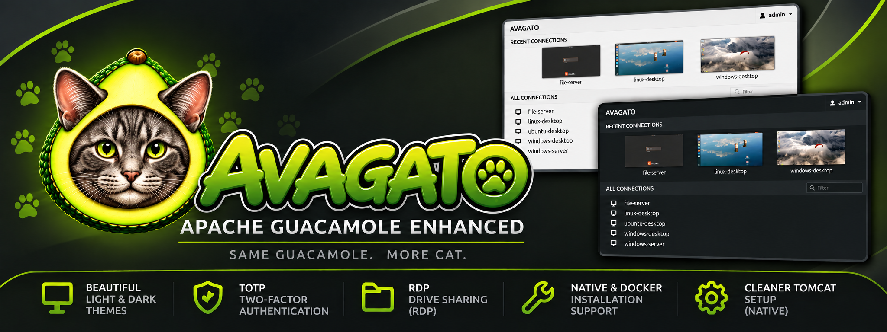
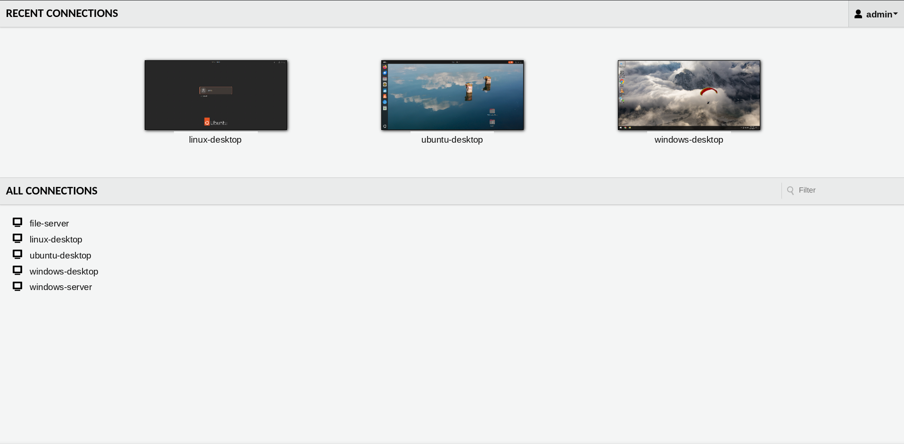
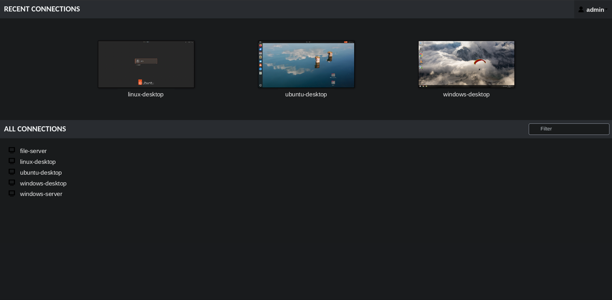
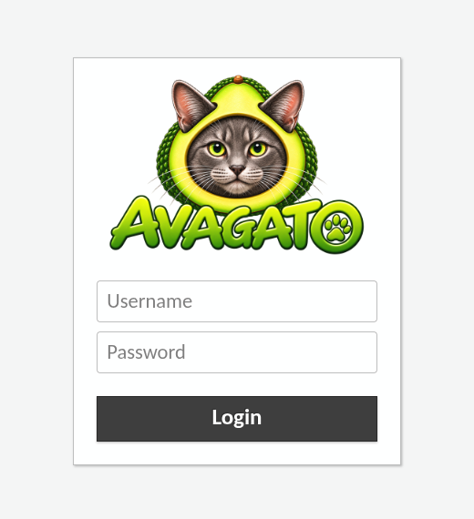
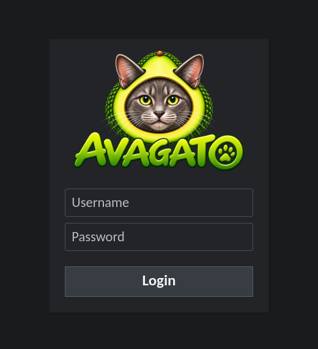
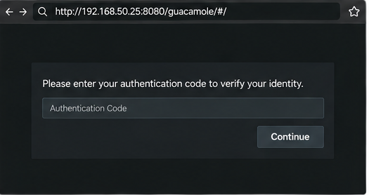
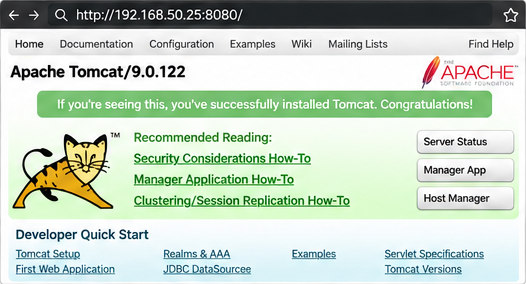

# Avagato



<p align="center"><strong>Apache Guacamole, with a little more cat.</strong></p>

> ### gato
> *Spanish · noun* — **cat**
>
> Same Guacamole. More cat.

**Avagato is a deployment and management tool for Apache Guacamole.** It can build and manage a complete Docker-based Guacamole stack on a Linux Docker host, including PostgreSQL and guacd, with optional TOTP authentication, Light and Dark Avagato themes, and RDP drive sharing. It also supports enhancing and managing existing Guacamole 1.6.0 installations created with Proxmox VE Community Scripts.

For new installations, Docker is the recommended path. Proxmox VE users can create a Community Scripts Docker LXC and let Avagato handle Guacamole from there. Avagato isn't limited to Proxmox, though — it can deploy its Docker stack on a suitable Linux Docker environment.

Avagato isn't a replacement for the Community Scripts installer. It's a companion for people who like that installer but prefer their guacamole with a little extra seasoning. And apparently a cat.

## At a glance

- **Docker is recommended for new Avagato installations.** Avagato deploys Guacamole 1.6.0, guacd 1.6.0, and PostgreSQL 17.
- **Avagato Docker is not Proxmox-specific.** It can run on a suitable Linux environment with Docker Engine and Docker Compose installed.
- **Proxmox users starting fresh have a recommended path.** Create a dedicated Docker LXC with Proxmox VE Community Scripts, then run Avagato inside that LXC.
- **Existing native Community Scripts Guacamole installs are supported.** Avagato recognizes the tested Guacamole 1.6.0 layout and can manage its Avagato enhancements.
- **Light and Dark themes are first-class choices.** Avagato installs prebuilt project theme JARs only after verifying their pinned SHA-256 hashes.
- **TOTP is optional.** Docker deployments use Guacamole's TOTP support through the managed stack; native installations use the official matching Guacamole TOTP extension.
- **RDP drive sharing is optional on Docker.** Avagato can expose `/opt/avagato/data/drive` to guacd as `/drive`.
- **Avagato is conservative.** It refuses ambiguous or unsupported environments instead of guessing or taking over an unknown Guacamole deployment.

## Light and Dark themes

Avagato includes matching Light and Dark themes built specifically for Guacamole 1.6.0.

| Avagato Light | Avagato Dark |
| --- | --- |
|  |  |
|  |  |

The installer downloads the canonical prebuilt theme artifact from this repository and verifies its pinned SHA-256 before installation. Avagato tracks which canonical variant is installed and can safely switch between Light and Dark.

If another JAR occupies an Avagato-managed theme filename but does not match a recognized canonical Avagato artifact, Avagato refuses to overwrite or remove it.

## Where can Avagato run?

Avagato's Docker deployment is **not Proxmox-specific**. Common Docker hosts include:

- a dedicated Docker LXC on Proxmox VE;
- a Linux virtual machine running Docker;
- a physical Linux Docker host; or
- another suitable Linux environment with Docker Engine and Docker Compose available.

Proxmox users get a specific recommended procedure below because Community Scripts provides a convenient way to create the Docker LXC — **not because Proxmox is required**.

Regardless of the underlying platform, the Avagato Docker deployment currently uses:

```text
/opt/avagato
```

This location is currently **fixed and is not configurable by the installer**. The canonical Compose file is therefore:

```text
/opt/avagato/docker-compose.yaml
```

## 🐱 Proxmox user planning a brand-new Guacamole install?

**Recommended procedure: create a dedicated Docker LXC with Proxmox VE Community Scripts, then let Avagato install Guacamole inside it.**

1. On your Proxmox VE host, use the [Proxmox VE Community Scripts](https://community-scripts.github.io/ProxmoxVE/) Docker LXC installer to create a dedicated Docker container.
2. Open the console or SSH into the new Docker LXC.
3. Run Avagato **inside the Docker LXC**:

   ```bash
   bash -c "$(curl -fsSL https://raw.githubusercontent.com/samwathegreat/avagato/main/avagato.sh)"
   ```

4. Avagato detects Docker and offers to create its complete Guacamole deployment under `/opt/avagato`.
5. Complete Avagato's first-run setup and open Guacamole.

> [!IMPORTANT]
> **Do not run Avagato on the Proxmox VE host itself.** Avagato intentionally refuses that environment.

Already have a Guacamole LXC created by the Community Scripts **Apache Guacamole** installer? You do not need to rebuild it. Avagato supports the tested native Guacamole 1.6.0 layout too; see **Existing native Community Scripts installation** below.

## Quick Start

Run Avagato as **root**:

```bash
bash -c "$(curl -fsSL https://raw.githubusercontent.com/samwathegreat/avagato/main/avagato.sh)"
```

The `bash -c "$(curl ...)"` form is intentional: Avagato is interactive, and this keeps standard input attached to the terminal.

Avagato detects the environment before deciding what to do.

### New installation: Docker

For a new Docker installation, use a suitable Linux system with:

- Docker Engine
- Docker Compose
- root access

Avagato creates its managed deployment at `/opt/avagato`. That path is currently fixed and cannot be changed through the installer.

The stack uses:

```text
guacamole/guacamole:1.6.0
guacamole/guacd:1.6.0
postgres:17
```

On first install, Avagato creates the deployment, generates the required database credentials, initializes PostgreSQL, starts the stack, waits for Guacamole to respond, and offers the supported Avagato configuration choices.

After first login with Guacamole's initial `guacadmin` account, create and verify a separate administrator account. Then disable the `guacadmin` login or change its password.

### Existing native Community Scripts installation

Avagato also supports the tested native Guacamole 1.6.0 layout produced by the Proxmox VE Community Scripts Guacamole installer.

> [!IMPORTANT]
> **Take a full Proxmox backup or snapshot before changing a native Guacamole installation.** Avagato preserves the Tomcat files it manages and provides restore options, but that is not a substitute for a complete backup.

Run the same launcher **inside the Guacamole LXC**, as root:

```bash
bash -c "$(curl -fsSL https://raw.githubusercontent.com/samwathegreat/avagato/main/avagato.sh)"
```

Avagato verifies the expected native layout and Guacamole version before presenting the native management menu.

## Docker management

Once an Avagato Docker deployment exists, running the launcher again opens its management interface.

```text
1. Enable TOTP
2. Disable TOTP
3. Install / switch / update Avagato Theme
4. Remove Avagato Theme
5. Change HTTP port
6. Configure RDP drive sharing
7. Start / reconcile deployment
Q. Quit
```

Avagato limits its Compose edits to settings it owns. When a requested change would be ambiguous, it refuses rather than rewriting unrelated user configuration.

### HTTP port

The published Guacamole HTTP port can be changed through Avagato. Guacamole remains on its normal internal container port; Avagato updates the host-side mapping in the managed deployment.

### Start / reconcile

The reconcile action applies the current managed Compose configuration and brings the stack up without requiring a reinstall.

## TOTP authentication

Avagato supports Guacamole's TOTP authentication.



On Docker deployments, Avagato enables or disables TOTP through the managed Guacamole configuration.

On supported native installations, Avagato installs or removes the **official Apache Guacamole TOTP extension matching Guacamole 1.6.0**.

Removing TOTP support does **not** erase users' TOTP enrollment data from the Guacamole database. If TOTP is later enabled again, previously enrolled users may be asked for their existing authenticator code.

If an enrolled authenticator is lost, use [Guacamole's documented TOTP reset procedure](https://guacamole.apache.org/doc/gug/totp-auth.html#resetting-totp-data).

Accurate system time is required for TOTP to work correctly.

## Docker RDP drive sharing

Avagato can optionally provide a shared directory for Guacamole RDP file transfers.

For an ordinary Docker installation, the mapping is simply:

```text
Docker host:     /opt/avagato/data/drive
                       │
                       │ Avagato-managed Docker volume mapping
                       ▼
guacd container: /drive
```

Inside a Guacamole RDP connection, the drive path presented to `guacd` is `/drive`.

If you are happy for transferred files to live in the Docker host's normal `/opt/avagato/data/drive` directory, **nothing else is required**.

### Optional: Proxmox host storage

If Avagato is running inside a Docker LXC on Proxmox, you may instead want transferred files to live on storage managed outside the LXC — for example, a larger storage pool or dataset, storage with different backup/snapshot behavior, or storage you want to manage independently of the Docker LXC.

In that case the full path looks like this:

```text
Proxmox host storage
        │
        │ user-managed Proxmox bind mount
        ▼
Docker LXC: /opt/avagato/data/drive
        │
        │ Avagato-managed Docker volume mapping
        ▼
guacd: /drive
        │
        ▼
Guacamole RDP connection
```

**Avagato manages only the mapping from `/opt/avagato/data/drive` into guacd as `/drive`.** It does not create or manage the Proxmox bind mount.

Configure the Proxmox-side storage so that it appears inside the Docker LXC at exactly:

```text
/opt/avagato/data/drive
```

Avagato can then handle the Docker-side mapping into `guacd`.

### Permissions for an external Proxmox bind mount

This section matters **only if you choose to bind-mount storage from outside the Docker LXC**.

Avagato does **not** manage ownership or permissions on storage supplied by the Proxmox host. In the Avagato Docker deployment, `guacd` runs as:

```text
UID 1001
GID 1001
```

If `/opt/avagato/data/drive` is backed by a Proxmox host bind mount, you are responsible for making sure the resulting storage is writable by `1001:1001` as seen from inside the Docker LXC. Depending on your Proxmox/LXC configuration, UID/GID mapping may also need to be considered.

> [!NOTE]
> **If you are not using an external Proxmox bind mount, you do not need to perform this permissions setup.** This is only an advanced consideration when supplying storage from outside the Docker LXC.

Make sure an external mount is available and has appropriate permissions before relying on it for Guacamole file storage.

Avagato preserves unrelated existing `guacd` volume mappings when enabling or disabling its own RDP drive mapping. It validates the candidate Compose configuration before replacing the live file and refuses ambiguous configurations instead of guessing.

Disabling RDP drive sharing removes Avagato's Docker mapping but does **not** delete the data under `/opt/avagato/data/drive`.

## Native enhancements

The native path exists specifically for the supported Community Scripts Guacamole 1.6.0 layout. It does not turn Avagato into a general-purpose modifier for arbitrary Tomcat or Guacamole installations.

### Tomcat cleanup and root redirect

A stock Community Scripts installation exposes Tomcat at:

```text
http://host:8080/
```

while Guacamole itself is under:

```text
http://host:8080/guacamole/
```



Avagato preserves the original Tomcat ROOT application and replaces it with a small redirect so browsing to `/` sends the browser to `/guacamole/`.

It can also move Tomcat's `docs`, `examples`, `manager`, and `host-manager` applications outside `webapps`. These applications are not required by Guacamole. Avagato preserves them for restoration.

This **does not change Guacamole's `/guacamole/` context path**.

### Native theme management

Native installations get the same canonical Avagato Light and Dark theme choices as Docker. The status display identifies the installed variant and version, and switching themes removes only a hash-verified canonical Avagato theme.

### Native restore behavior

The native menu provides restoration for the Tomcat changes, TOTP extension, and Avagato theme.

Avagato is deliberately conservative during restore. If both a preserved Tomcat application and a live copy exist, if both Avagato theme variants are unexpectedly present, or if a theme JAR at an Avagato-managed filename is not a recognized canonical artifact, Avagato refuses the operation rather than choosing what to overwrite or delete.

Removing the native TOTP extension does not alter Guacamole's database.

## Environment detection and safety

Avagato checks the environment before making changes. It is designed to:

- manage an existing Avagato Docker deployment;
- install a new Docker deployment when Docker Engine and Compose are available and no conflicting native Guacamole installation is detected;
- manage the supported native Community Scripts Guacamole 1.6.0 layout;
- refuse to run directly on a Proxmox VE host;
- refuse an ambiguous machine containing both a supported native installation and a Docker Guacamole deployment;
- refuse to take over an unknown or non-Avagato Docker Guacamole deployment; and
- refuse an unsupported native Guacamole layout/version rather than guessing.

Simply launching Avagato does not apply an enhancement without the relevant selection and confirmation.

## Docker vs. native

For **new installations**, Docker is the recommended Avagato path. It gives Avagato a predictable, self-contained stack and keeps Guacamole deployment and Avagato management together.

For **Proxmox VE users starting from scratch**, the recommended arrangement is a dedicated Community Scripts Docker LXC with Avagato run inside it.

The **native path** is for an existing compatible Community Scripts Guacamole installation that you want to keep. It adds Avagato's enhancements without migrating the Guacamole database to Docker.

Database migration between native and Docker deployments is outside Avagato's scope.

## Project layout

```text
avagato/
├── avagato.sh
├── lib/
│   ├── common.sh
│   ├── detect.sh
│   ├── docker.sh
│   ├── native.sh
│   └── theme.sh
├── theme/
│   ├── avagato-dark-theme.jar
│   ├── avagato-light-theme.jar
│   └── assets/
│       ├── avagato-login.png
│       ├── avagato-large.png
│       └── avagato-small.png
├── screenshots/
│   ├── avagato.png
│   ├── avagato-light-dashboard.png
│   ├── avagato-dark-dashboard.png
│   ├── avagato-light-login.png
│   ├── avagato-dark-login.png
│   ├── before-tomcat.png
│   └── totp.png
├── README.md
└── LICENSE
```

The PNG files under `theme/assets/` are retained as project source assets for future maintainer theme builds. Normal theme installation uses the canonical prebuilt JARs.

## Compatibility

Current Avagato development targets **Apache Guacamole 1.6.0**.

The native path has been tested against the Proxmox VE Community Scripts Guacamole 1.6.0 layout. Avagato intentionally validates the environment instead of assuming every historical or future Community Scripts installation has the same layout.

The Docker path is independent of Proxmox and can be used on a suitable Linux Docker host. The Docker deployment currently always uses `/opt/avagato`; the installer does not offer a custom installation path.

## What Avagato does not do

Avagato does not:

- replace Apache Guacamole itself;
- manage your reverse proxy;
- migrate a Guacamole database between native and Docker deployments;
- directly edit or purge users' TOTP secrets from the Guacamole database;
- take over arbitrary existing Docker Guacamole stacks;
- modify unsupported native Guacamole layouts;
- create or manage Proxmox host bind mounts or their permissions; or
- install directly onto a Proxmox VE host.

## Independence

Avagato is an independent community project. It is not affiliated with or endorsed by the Apache Software Foundation, the Apache Guacamole project, Proxmox Server Solutions GmbH, or the Proxmox VE Community Scripts project.

Apache, Apache Guacamole, and related marks belong to their respective owners. Proxmox is a trademark of Proxmox Server Solutions GmbH.

## License

Avagato is released under the **MIT License**. See [LICENSE](LICENSE).
